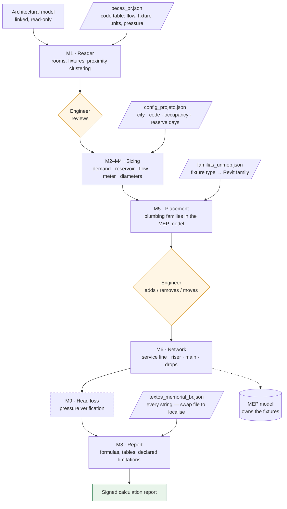

# revit-hydro-designer

Automated plumbing design for Autodesk Revit — reads an architectural BIM model,
sizes the cold-water system to code, models the pipe network, and issues a
calculation report ready for an engineer's signature.

Built with [pyRevit](https://github.com/pyrevitlabs/pyRevit) and driven through
the pyRevit Routes REST API, so any MCP-capable AI assistant can develop against
a live Revit session.

> **Status: work in progress.** Cold water (água fria) is implemented end to end.
> Hot water, sanitary drainage, stormwater and septic systems are planned.
> See [the project plan](PLANO-HIDROSSANITARIO.md) (Portuguese) for the roadmap
> and for every engineering decision taken so far.

---

## Why this exists

Residential plumbing design is highly repetitive: read the fixtures, apply the
code tables, size the pipes, draw the network, write the report. The judgement
that matters — where the shafts go, what the client actually wants, whether a
result is sane — is a small fraction of the hours spent.

This project automates the repetitive part and, deliberately, **stops at every
point where judgement is required** so the engineer can review and correct.

It also has a practical origin: the author designed plumbing systems using a
commercial Revit add-in whose licence has since lapsed. The families and shared
parameters remain in her templates, but the calculation engine is gone. This
rebuilds that engine, in the open.

---

## What works today

| Stage | What it does | Status |
|---|---|---|
| **M0** Audit | Model health check: pipe types and routing preferences, systems, families, parameters, naming conventions, warnings, orphan views | ✅ |
| **M1** Reader | Reads fixtures and rooms from the linked architectural model, clusters coincident families into single consumption points, classifies each by code | ✅ |
| **M2–M4** Sizing | Occupancy, daily demand, reservoir volume, design flow (weighted-fixture-unit method), water meter selection, service-line diameter, sub-branch sizing | ✅ |
| **M5** Placement | Places the matching plumbing families in the MEP model at the correct level | ✅ |
| **M6** Network | Models the cold-water network: service line, riser, distribution main sized by cumulative load, drops to each fixture | 🟡 pipes modelled, physical connectors not yet joined |
| **M8** Report | Generates a print-ready calculation report (HTML → PDF) with formulas, tables and declared limitations | ✅ |
| **M9** Head loss | Pressure-drop verification | ⬜ planned |

Everything downstream — hot water, drainage, venting, stormwater, septic tank /
filter / soakaway — reuses the same architecture.

---

## Design principles

**Knowledge lives in JSON, not in code.** Code tables, family mappings,
classification rules and report text are all data files. Adding a fixture type or
adjusting a rule is editing a file, not editing Python.

```
data/pecas_br.json          # code table: flow, fixture units, minimum pressure
data/familias_unmep.json    # fixture type → Revit family mapping
data/config_projeto.json    # per-project inputs (city, occupancy, reserve days)
data/textos_memorial_br.json # every string in the report — translate to localise
```

**The calculation engine is separable from the modelling engine.** Reading the
model, routing and reporting are country-agnostic; the code rules are a pluggable
module. Brazilian NBR 5626 is implemented; French DTU 60.11 is the next target,
and it is genuinely different — NBR uses weighted fixture units, DTU uses a
simultaneity coefficient over raw demand.

**The engineer stays in the loop.** Each stage reports what it found and what it
assumed before the next stage runs. This is not ceremony: two real errors were
caught exactly this way — architectural models double-counting a single basin
modelled as several nested families, and a room named *banho suíte* (ensuite
**bathroom**) being counted as a bedroom, inflating occupancy by a third.

**Limitations are declared, not hidden.** The generated report states in writing
what was not verified. An automated tool that overstates its own scope is worse
than no tool.

---

## How it works



The amber diamonds are deliberate stops. Automation without a review point is a
trap: both real bugs found so far — double-counted basins and a bathroom counted
as a bedroom — would have passed silently without them.

The MEP model owns the fixtures; the architectural model is linked for context
only. This matches both ISO 19650 practice and reality: architects do not model
plumbing well, so the engineer places the fixtures the client actually needs.
Missing fixtures are declared in project configuration rather than requiring the
architectural model to be corrected.

---

## Requirements

- Autodesk Revit (developed against 2027; the API calls used are version-tolerant)
- [pyRevit](https://github.com/pyrevitlabs/pyRevit)
- A Revit template containing plumbing families with configured routing preferences

## Installation

1. Clone this repository.
2. In Revit: **pyRevit → Settings → Custom Extension Directories** → add the
   folder *containing* `revit-hydro-designer.extension`.
3. **Save Settings and Reload.** A **Hydro** tab appears.

## Development against a live Revit session

`tools/run_in_revit.sh` posts a Python file to the pyRevit Routes API
(`http://localhost:48884`), which executes it inside the running Revit process
and returns stdout. This makes the write → run → read-the-real-error → fix loop
possible without leaving the editor.

```bash
./tools/run_in_revit.sh tools/m1_reader.py "read fixtures"
```

Enable **Routes Server** in pyRevit settings first, and bind it to `127.0.0.1`.
The Routes API is a draft feature with no authentication — do not expose it.

---

## Notes for contributors

Two environments, two sets of rules:

| | pyRevit buttons | Routes bridge |
|---|---|---|
| Engine | CPython 3.12 | IronPython 2.7 |
| f-strings | yes | no |
| Accented literals | safe | **corrupted** — read them from JSON |

Revit API traps found the hard way and worth knowing:

- `element.Name` is ambiguous on `PipeType`, `PipingSystemType` and
  `FamilySymbol`. Use `Element.Name.__get__(el)`.
- `RoutingPreferenceRuleGroupType` members are plural: `Elbows`, `Junctions`,
  `Crosses`, `Transitions`, `Unions`, `MechanicalJoints`, `Caps`.
- `ElementId.Value` returns a long, which IronPython's `json` cannot serialise.
- Deleting a pipe cascades to its fittings, so a batch `doc.Delete` fails wholesale
  on an id that is already gone. Delete one at a time, checking for `None` first.
- Fixture weight is an *instance* parameter on specific families and a *type*
  parameter on generic ones. Check both.

**Known limitation:** paths are currently hardcoded to the author's machine.
Parameterising them is the first task for anyone wanting to run this elsewhere.

---

## Licence

MIT — see [LICENSE](LICENSE).

## Author

Thayna Barreiro — civil engineer, BIM coordinator.
[github.com/Thaynabarreiro](https://github.com/Thaynabarreiro)
