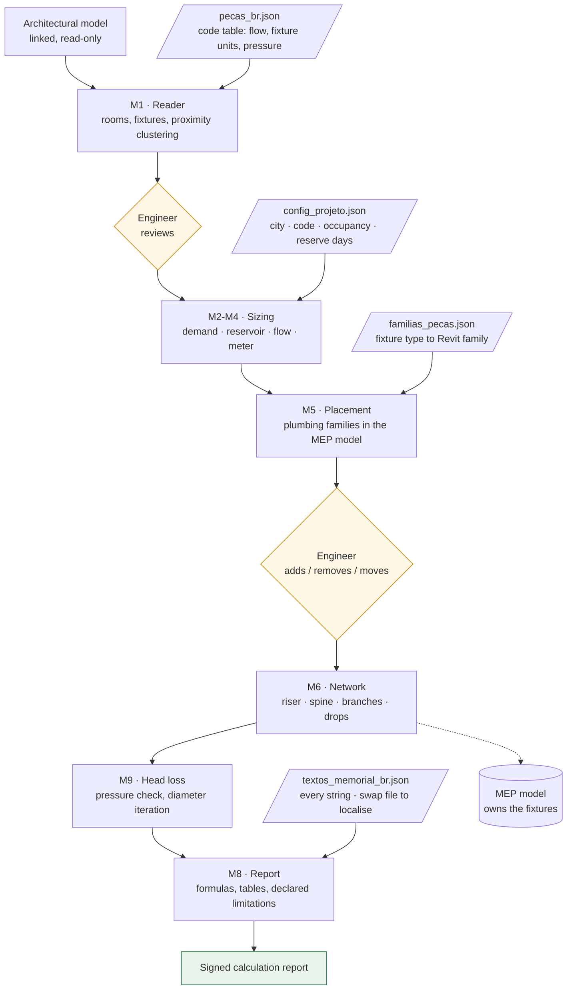

# revit-hydro-designer

Automated plumbing design for Autodesk Revit — reads an architectural BIM model,
sizes the cold-water system to code, models the pipe network, verifies pressure,
and issues a calculation report ready for an engineer's signature.

Built with [pyRevit](https://github.com/pyrevitlabs/pyRevit) and driven through
the pyRevit Routes REST API, so any MCP-capable AI assistant (such as Claude Code) can develop against
a live Revit session.

> **Status: work in progress.** Cold water is implemented end to end, including
> head-loss verification. Hot water, sanitary drainage and venting, stormwater
> and on-site sewage treatment are planned, as is a second national code module.
> See [the project plan](PROJECT-PLAN.md) for the full scope and for every
> engineering decision taken so far.

---

> [!WARNING]
> **Engineering Disclaimer**
> This tool is an automated calculation and modeling assistant for qualified civil and building-services engineers. It automates repetitive NBR 5626, NBR 8160, and NBR 10844 calculations and geometry generation. All sizing outputs, pressure verification, and generated reports MUST be reviewed, validated, and approved by a licensed engineer prior to construction or municipal submission.

---

## Why this exists

Residential plumbing design is highly repetitive: read the fixtures, apply the
code tables, size the pipes, draw the network, write the report. The judgement
that matters — where the shafts go, what the client actually wants, whether a
result is sane — is a small fraction of the hours spent.

Tools that automate this for Revit exist, but they are closed and paid. There is
no open-source equivalent, which means a practising engineer cannot inspect the
rules being applied on their behalf, adapt them to a different national code, or
keep working when a licence ends. This is an attempt at one that is readable and
adaptable.

It automates the repetitive part and, deliberately, **stops at every point where
judgement is required** so the engineer can review and correct.

---

## What works today

| Stage | What it does | Status |
|---|---|---|
| **M0** Audit | Model health check: pipe types and routing preferences, systems, families, parameters, naming conventions, warnings, orphan views | ✅ |
| **M1** Reader | Reads fixtures and rooms from the linked architectural model, clusters coincident families into single consumption points, classifies each by code | ✅ |
| **M2–M4** Sizing | Occupancy, daily demand, reservoir volume, design flow (weighted-fixture-unit method), water meter selection, service-line diameter | ✅ |
| **M5** Placement | Places the matching plumbing families in the MEP model at the correct level | ✅ |
| **M6** Network | Models the network with a real main-and-branch topology — riser, spine, perpendicular branches, drops — with every fixture physically connected | ✅ |
| **M9** Head loss | Pressure verification by Fair-Whipple-Hsiao plus equivalent lengths, iterating diameters until every fixture clears | ✅ |
| **M8** Report | Print-ready calculation report (HTML → PDF) with formulas, tables and declared limitations | ✅ |

Worked example — a single-family house with 11 fixtures:

```
14 rooms · 9 consumption points found · 3 coincident families clustered
3 bedrooms -> 6 occupants -> 900 L/day -> 2000 L storage (2 days reserve)
sum of weights 5.50 -> design flow 0.704 L/s -> 3.0 m3/h meter, DN 20 service
34 pipes · 78.58 m · 11/11 fixtures connected · DN 25 branches, DN 32 riser
critical fixture clears by 0.06 m of head
```

Everything downstream — hot water, drainage and venting, stormwater, on-site
sewage treatment — reuses the same architecture. Hot water reuses roughly 80% of
what already exists. Drainage is the one that needs a genuinely new router,
because gravity flow is a constrained problem where pressurised flow was not.

---

## Design principles

**Knowledge lives in JSON, not in code.** Code tables, family mappings,
classification rules, fitting equivalent lengths and every string in the report
are data files. Adding a fixture type, adjusting a rule or translating the report
is editing a file, not editing Python.

```
data/pecas_br.json            code table: flow, weight, fixture units, pressure
data/perda_carga_br.json      head-loss formula and equivalent lengths
data/familias_pecas.json      fixture type -> family in your template
data/config_projeto.json      per-project inputs
data/textos_memorial_br.json  every string in the report
```

Files ending in `.example.json` are templates to copy. Real `.json` files are git-ignored because they describe specific building data and office templates.

**The calculation engine is separable from the modelling engine.** Reading the
model, routing and reporting are country-agnostic; the code rules are a pluggable
module. Brazilian NBR 5626 is implemented; French DTU 60.11 is the next target,
and it is genuinely different — NBR uses weighted fixture units, DTU uses a
simultaneity coefficient over raw demand.

**Project decisions are settings, not assumptions.** Occupancy, per-capita
demand, days of reserve, maximum velocity and minimum diameter all live in
project configuration. Many offices refuse DN 20 as too fragile on site; raising
the floor to DN 25 is one field, and it visibly changes the result — on the
worked example it cut the sizing iterations from 13 to 4.

**The engineer stays in the loop.** Each stage reports what it found and what it
assumed before the next stage runs. This is not ceremony: two real errors were
caught exactly this way — architectural models double-counting a single basin
modelled as several nested families, and a room named *banho suíte* (ensuite
**bathroom**) counted as a bedroom, inflating occupancy by a third.

**Limitations are declared, not hidden.** The generated report states in writing
what was not verified. An automated tool that overstates its own scope is worse
than no tool.

---

## How it works



---

## Requirements

- **Autodesk Revit 2027** (currently verified version; API calls used are designed for cross-version compatibility).
- [pyRevit v4.8+](https://github.com/pyrevitlabs/pyRevit)
- A Revit template containing plumbing families with configured routing preferences.

---

## Installation & First-Run Setup

1. **Clone this repository**:
   ```bash
   git clone https://github.com/Thaynabarreiro/revit-hydro-designer.git
   ```

2. **Configure Project Settings**:
   Copy the example JSON configuration files in `data/`:
   ```bash
   cp data/config_projeto.example.json data/config_projeto.json
   cp data/familias_pecas.example.json data/familias_pecas.json
   ```
   Edit `data/config_projeto.json` and `data/familias_pecas.json` to match your local project requirements and template family names.

3. **Configure pyRevit Extension**:
   - Open Revit 2027.
   - Go to **pyRevit → Settings → Custom Extension Directories**.
   - Add the folder path *containing* `revit-hydro-designer.extension`.
   - Click **Save Settings and Reload**.
   - The **Hydro** tab will appear in the Revit ribbon with discipline-based panels.

---

## Development against a live Revit session (Claude Code & MCP)

The development workflow leverages pyRevit's Routes REST server (`http://localhost:48884`), which executes Python tools directly inside the active Revit process and returns stdout.

### 1. Enable pyRevit Routes Server
- In Revit: **pyRevit → Settings → Routes Server**.
- Enable the Routes server and bind it strictly to `127.0.0.1`.

### 2. Configure MCP Server for AI Assistant (e.g. Claude Code)
- Copy `.mcp.example.json` to `.mcp.json`:
  ```bash
  cp .mcp.example.json .mcp.json
  ```
- Edit `.mcp.json` to specify your local pyRevit extension directory path.

### 3. Run Validation Script via Bridge
```bash
python tools/run_in_revit.py tools/m1_reader.py "read fixtures"
```

---

## Troubleshooting & First-Run Validation

- **Issue: `ConnectionRefusedError: [WinError 10061]` when running bridge**
  - **Cause**: pyRevit Routes Server is not running or not bound to `127.0.0.1:48884`.
  - **Fix**: Open Revit 2027, verify pyRevit is loaded, and enable the Routes server in pyRevit settings.

- **Issue: `KeyError: 'familias'` when running M5 placement**
  - **Cause**: `data/familias_pecas.json` does not exist or missing family mapping.
  - **Fix**: Ensure `data/familias_pecas.example.json` was copied to `data/familias_pecas.json`.

---

## Notes for contributors

See [CONTRIBUTING.md](CONTRIBUTING.md) for full development guidelines.

Two environments, two sets of rules:

| | pyRevit buttons | Routes bridge |
|---|---|---|
| Engine | CPython 3.12 | IronPython 2.7 |
| f-strings | yes | no |
| Accented literals | safe | **corrupted** — read them from JSON |

Revit API traps found the hard way and worth knowing:

- `element.Name` is ambiguous on `PipeType`, `PipingSystemType` and
  `FamilySymbol`. Use `Element.Name.__get__(el)`.
- `ElementId(int)` is ambiguous too — it collides with the `BuiltInParameter` and
  `BuiltInCategory` overloads. Use `ElementId(System.Int64(i))`.
- `RoutingPreferenceRuleGroupType` members are plural: `Elbows`, `Junctions`,
  `Crosses`, `Transitions`, `Unions`, `MechanicalJoints`, `Caps`.
- `ElementId.Value` returns a long, which IronPython's `json` cannot serialise.
- Deleting a pipe cascades to its fittings, so a batch `doc.Delete` fails
  wholesale on an id that is already gone. Delete one at a time, checking for
  `None` first.
- Fixture weight is an *instance* parameter on specific families and a *type*
  parameter on generic ones. Check both.
- `Pipe.Create` from a `Connector` asks Revit to resolve the joint immediately;
  when it cannot, it opens a modal dialog and hangs a headless script forever.
  Create by coordinate and join afterwards with `ConnectTo`.
- Fittings need right angles. A layout that chains fixtures by proximity produces
  arbitrary angles that Revit refuses to fit.

---

## License

MIT — see [LICENSE](LICENSE).
